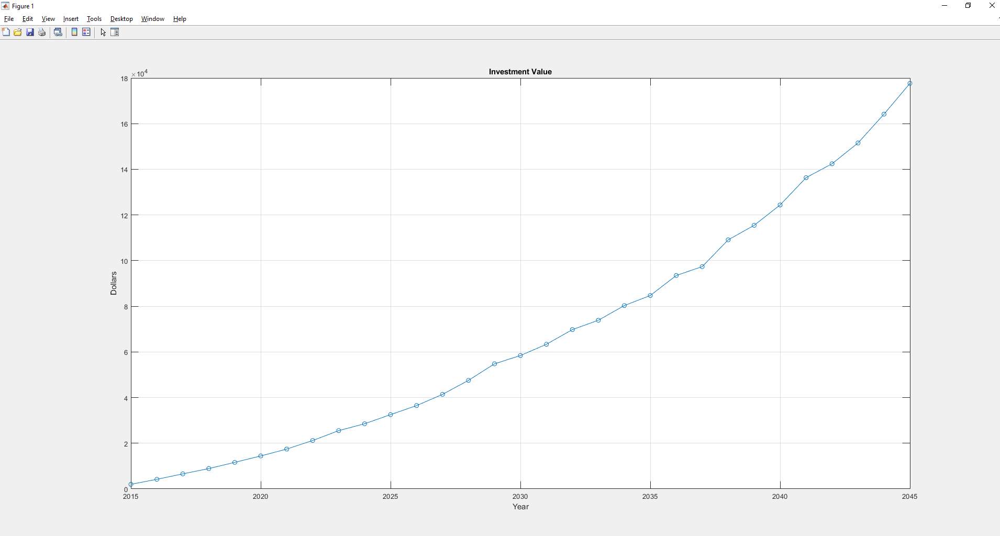
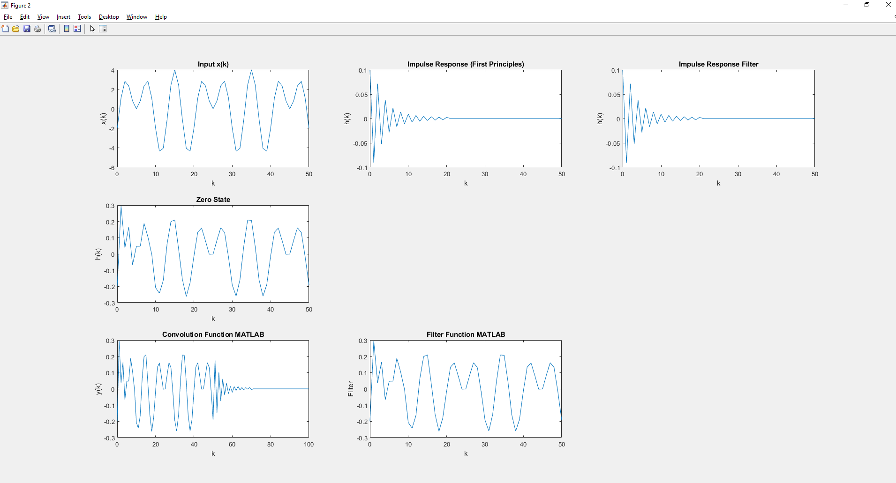

1. Jim opens an investment certificate today on his 30th birthday. He deposits $2000 at this time
and on every birthday thereafter. In addition, he earns interest compounded annually. The
table below shoes the rate of interest per year. Write a difference equation which calculates
the amount he’ll have in his account by his 60th birthday. Write a brief computer program to
calculate this amount. Hand in your code with the answer.
 

| Year | Interest Rate |
| :----: | :----: |
| 2016  | 10 |
| 2017  | 9 |
| 2018  | 5 |
| 2019  | 8 |
| 2020  | 7 |
| 2021  | 8 |
| 2022  | 10 |
| 2023  | 11 |
| 2024  | 4 |
| 2025  | 7 |
| 2026  | 6 |
| 2027  | 8 |
| 2028  | 10 |
| 2029  | 11 |
| 2030  | 3 |
| 2031  | 5 |
| 2032  | 7 |
| 2033  | 3 |
| 2034  | 6 |
| 2035  | 3 |
| 2036  | 8 |
| 2037  | 2 |
| 2038  | 10 |
| 2039  | 4 |
| 2040  | 6 |
| 2041  | 8 |
| 2042  | 3 |
| 2043  | 5 |
| 2044  | 7 |
| 2045  | 7 |
 

 
2. Consider the following running average filter. Write a MATLAB program that performs the
following tasks.
where x ( k ) =sin ( 0.1 πk ) −2 cos ( 0.2 πk ) + 3 sin ( 0.3 πk ) , 0 ≤ k < N
Compute and plot the impulse response h(k) for 0 ≤ k < N where N = 50 from 1st
principles. Now, use the functions ‘filter’ and ‘conv’ to arrive at the same results
 

 

