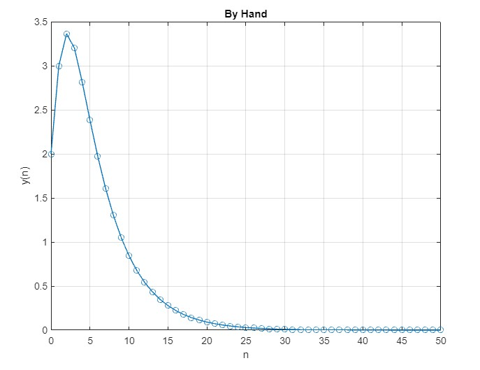
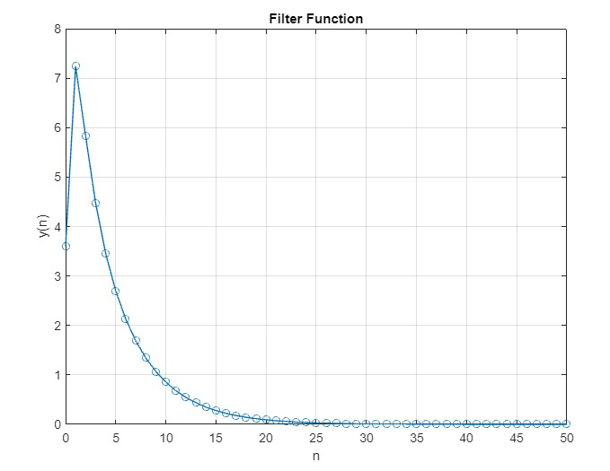

Given the following difference equation:
 
y(n) = .6y(n-1) - .05y(n-2) + 2x(n) + x(n-1), y(1) = 2, y(2) = 3
 
x(n) = .8 n+1 u(n)
 
1. Use Matlab to plot the full response y(n) iteratively.
 

 
2. Use the Matlab function filter to plot y(n) and compare the results. You will see a slight difference
in output between the iterative calculation and Matlab’s.
 

 