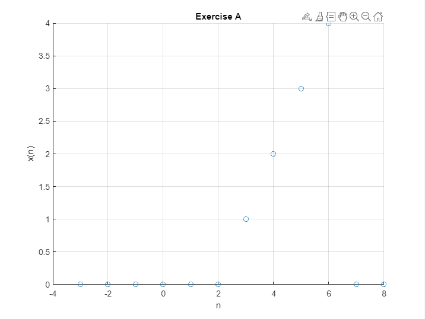
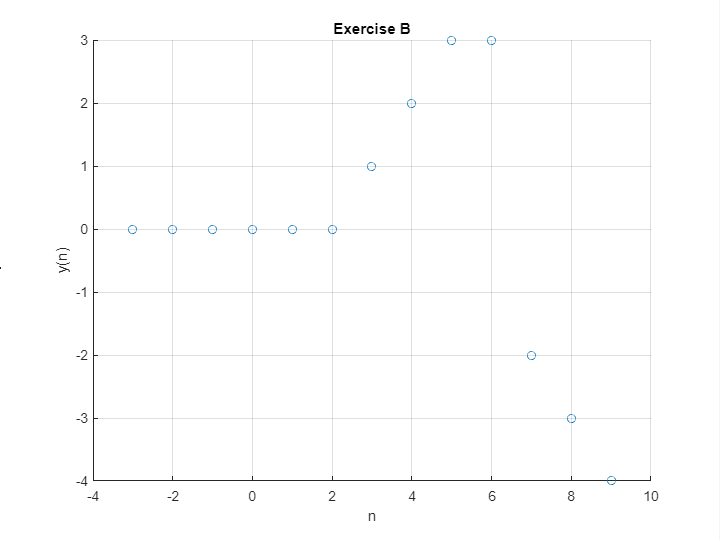
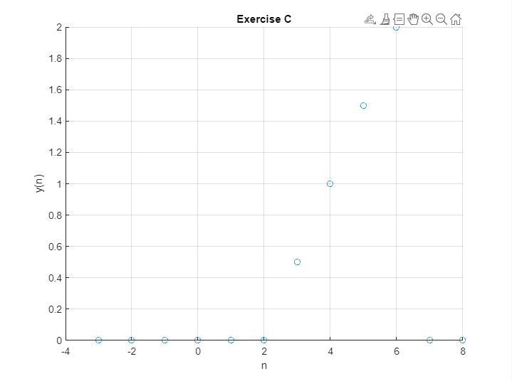
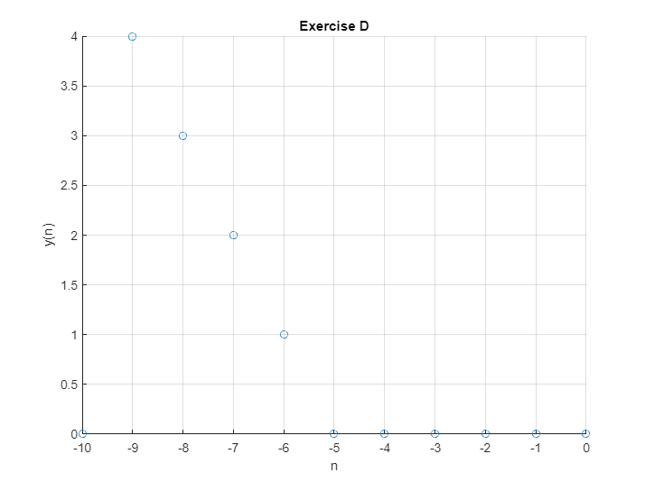

# Lab 1
 
Exercise a) Plot the discrete-time signal: x[n]={0, 0, 0, *0*, 0, 0, 1, 2, 3, 4, 0, 0...}. The boldface indice denotes the n = 0 value.
 

 
Determine and plot the following sequences: You must include all non-zero results
 
b) y1[n] = x[n] - x[n-3] (signal shifting and subtraction)
For this exercise, you will need to pad the array with zeros
 

 

c) y2[n]=0.5x[n] (scaling)
 

 
d) y3[n]= x[-n] (folding)
 

 