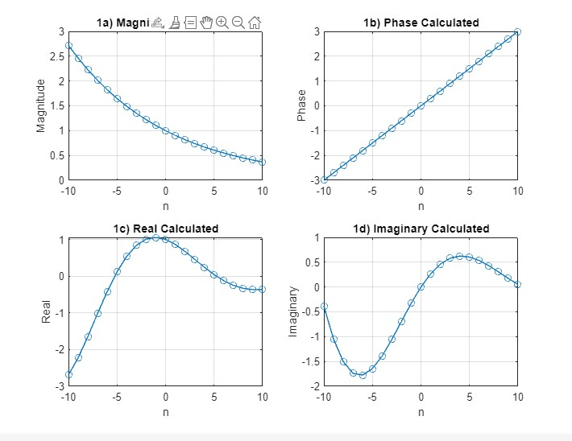
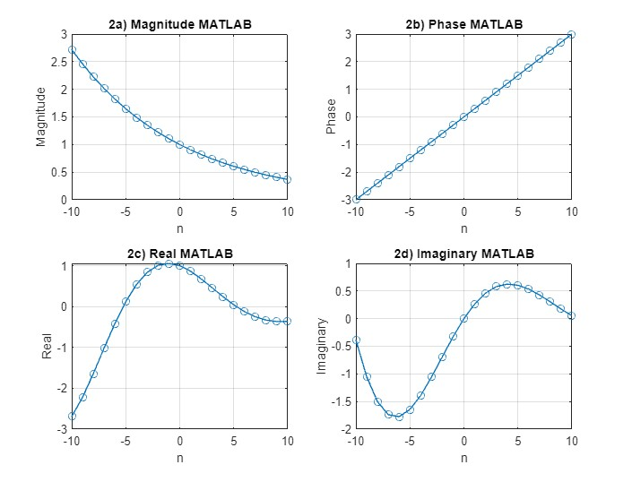

Using Matlab, generate the complex-valued signal
x [n]=e^(−0. 1+ j 0. 3 )n −10≤n≤10
 

 
1. Using 1st principles, calculate and plot its:
a. Magnitude
b. Phase
c. The real part
d. The imaginary part
in four separate subplots.
 

 
2. Using built-in Matlab functions, plot the function’s:
a. Magnitude
b. Phase
c. The real part
d. The imaginary part
in four separate subplots.
 

 