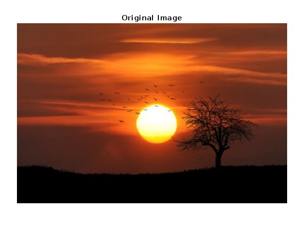
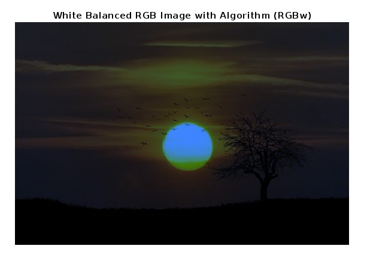
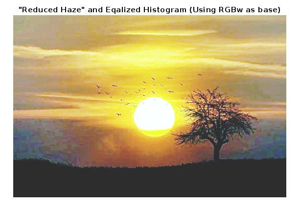
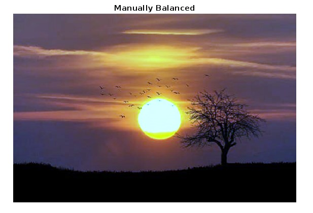

Colour correction is performed to correct the constituent colours in an image. For example, photos taken at midday will appear bluish in hue, photos at dawn/dusk appear reddish. In this assignment, students are to correct the included image to make it appear as close to true colour as possible.
 

Original Image

White Balanced Image

RGBw Base with Reduced Haze and Eq'ed Histogram

Manually Balanced