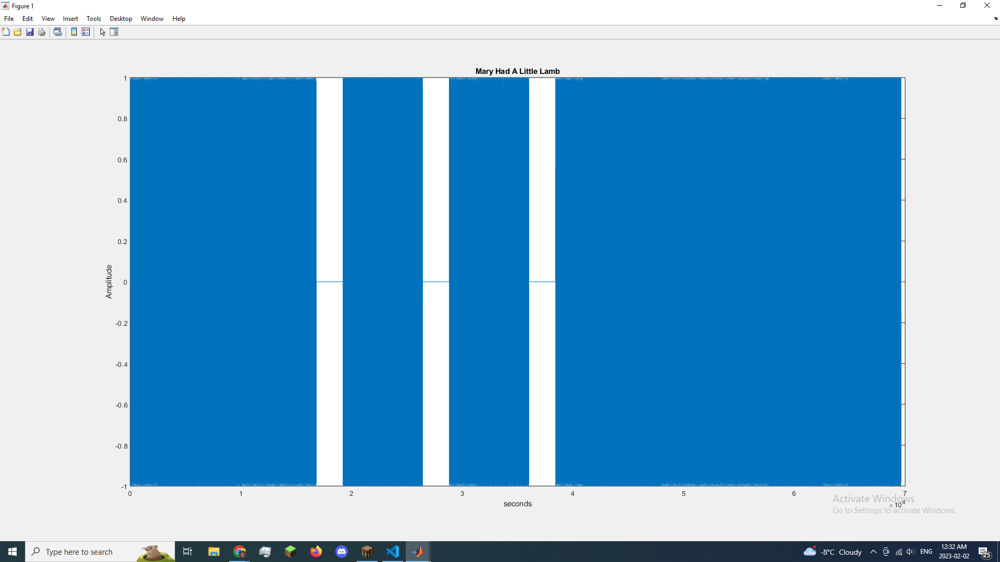

Music is a collection of tones played at a certain rate and sound amplitude. In this lab, you are to research how to create musical notes and then play a simple song of your own composition. Demonstrate to the instructor.
1. Use this program to generate both a carrier and a tonal input.
2. Plot out the results for several carrier and input frequency values.
 

