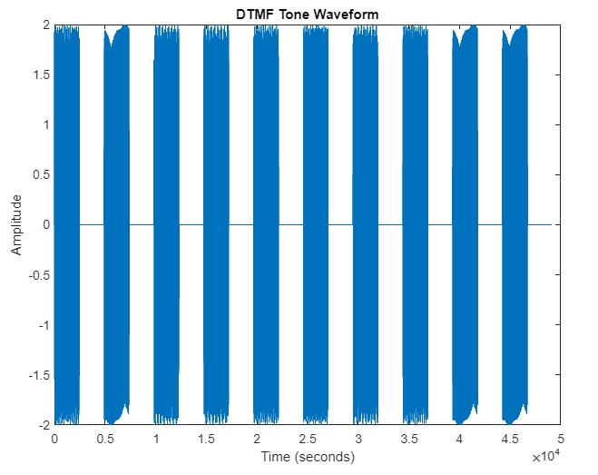

DTMF is matrix-based system of tones designed to give each number/symbol on the telephone keypad a unique frequency code. In this exercise, you are to design a DTMF system using a coding language such as Matlab. To demonstrate the functioning, students must play the results of a random set of numbers/symbols and then decode them correctly to the screen. Consult the lab notes for the various frequency values.

