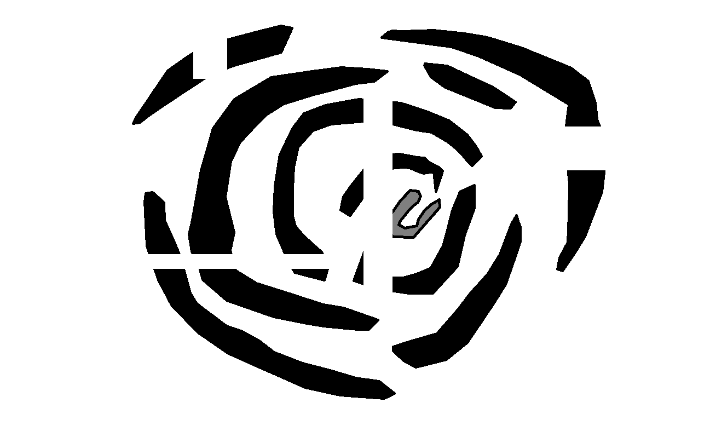
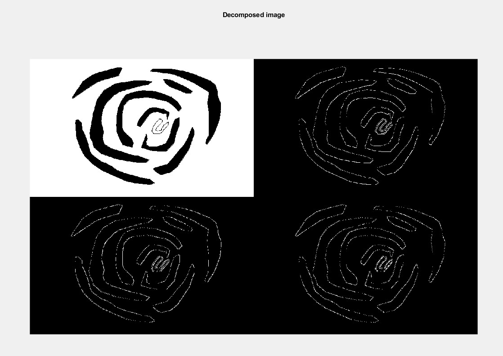
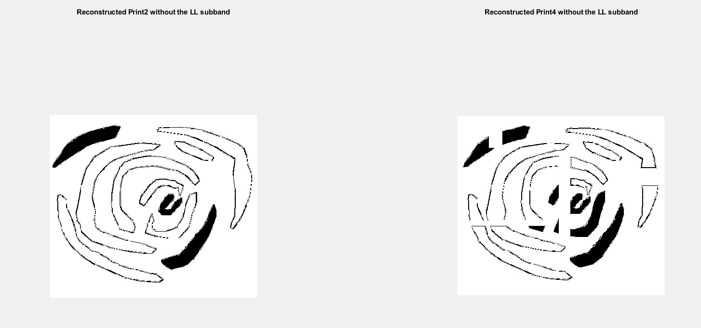

Derive an algorithm and then program to compare a new fingerprint to an existing one to determine whether there is a match. What characteristics are you looking for? How much deviation will you tolerate?
 

Original Fingerprint 

New Fingerprint 

After Applying Filters 

Side-by-side Comparison 