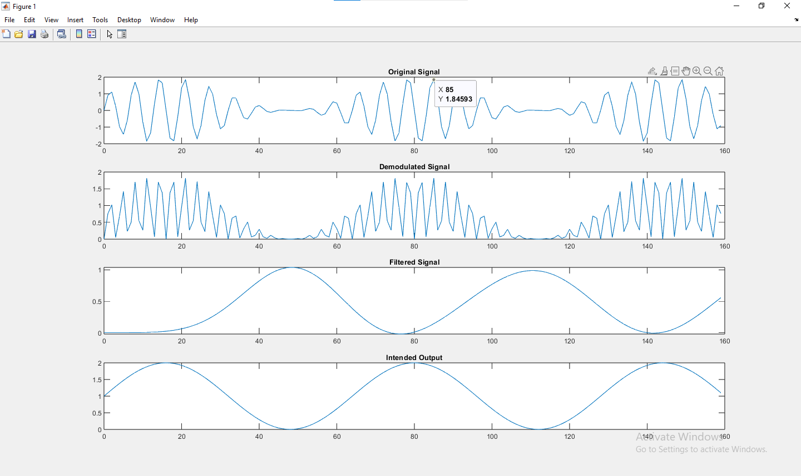

The Matlab program AM.m creates a carrier signal and modulates it using a single tonal input as the intelligence.  Add code to allow you to decode the original signal.  Use the following information:
 
v_demod (t)=0.5[A_c+ A_i sin(2πf_i (t))] - 0.5[A_c + A_i sin(2πf_i (t))]cos⁡(4πf_c t) 
 
Choose an appropriate Matlab filter to remove the carrier from the demodulated signal.
 
Show the output of the demodulated signal.
 

