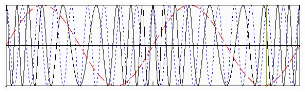
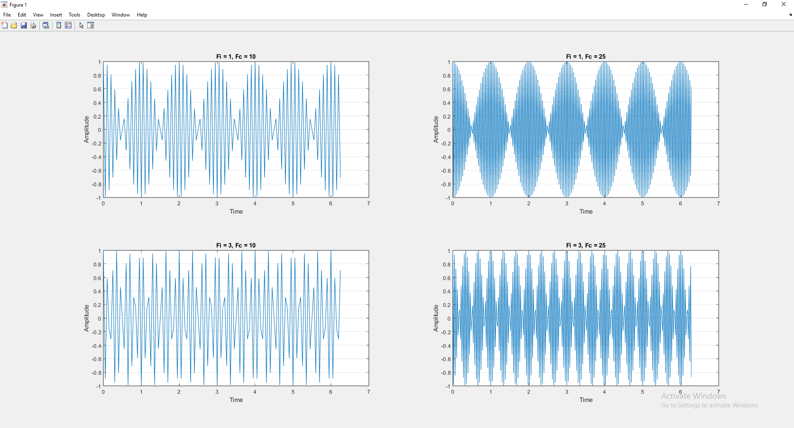
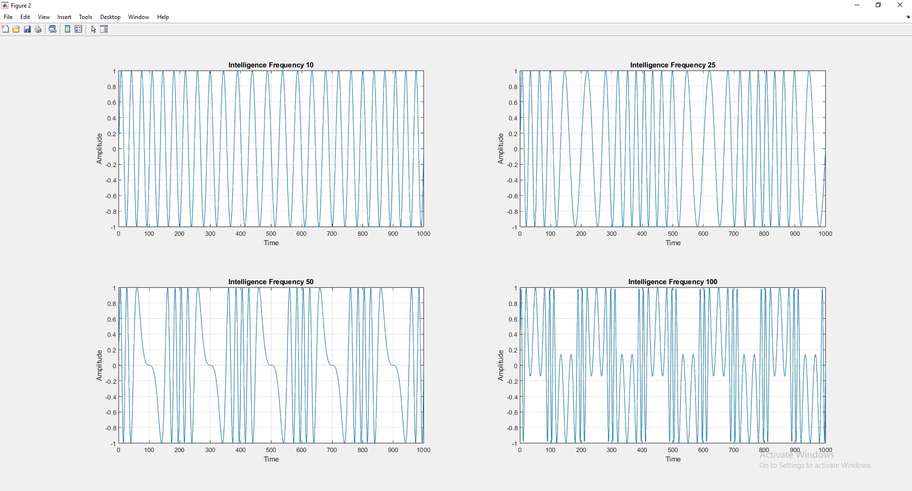

1. In Matlab, write a general program to generate a cos wave where the frequency can be varied. The actual formula portion should be a function call so that you don’t need to repeat code when calculating carrier and input tonal signal.
2. Use this program to generate both a carrier and a tonal input.
3. Plot out the results for several carrier and input frequency values.

 FM is produced via the following equation:
 
vFM = Asin[2πfct + mf * vi (t) sin(2πf * i(t))]
 
where: 
 A ≡ amplitude constant
 fc ≡ carrier frequency
 mf ≡ index of modulation
 fi(t) ≡ intelligence frequency as a function of time.
 The modulated waveform in comparison to the input intelligence is shown below:

4. Now write a program to produce analog FM modulation.
5. Plot the results for several carrier/input values.
6. Produce the spectral signature for one of the modulated signals.

