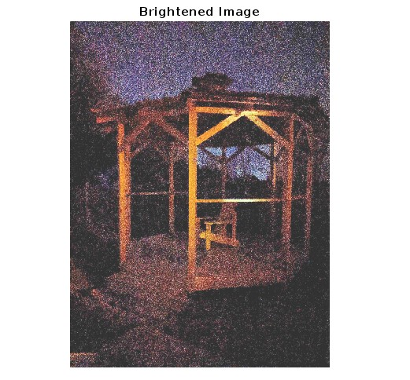

The given photo is taken under low lighting conditions. Process the image so that it looks like it was taken during daytime.

Original  

Using `imlocalbrighten` function  

Using `histeq` function 

Using revised histogram equalization  

All histogram charts 
