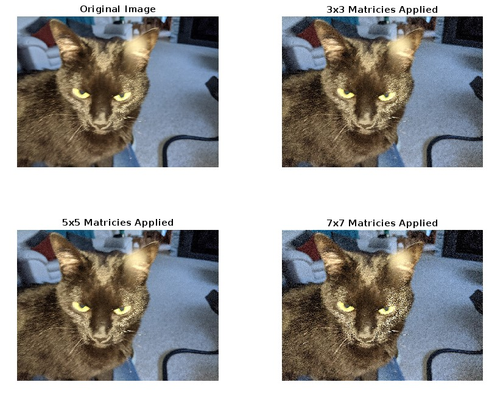

a) Using your knowledge of image filtering, correct the image. In this part, you can use the 3x3 filter matrices from demonstration package on the k-drive.
b) Now modify the filter matrices into 5x5 and 7x7 matrices. You will have to choose indice values for the additional rows/columns. Do you see any difference in results with the new matrices?
 

